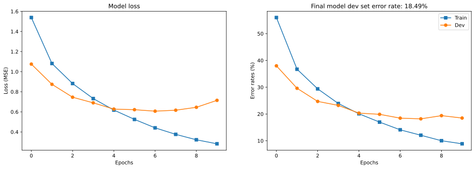
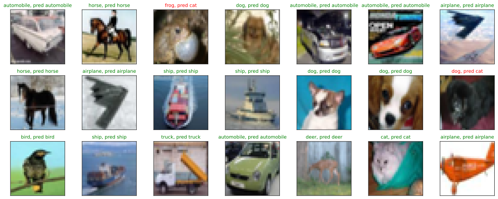

# Classify Cifar 10
- The goal of this project is to create a convolutional neural network to classify
images in the [CIFAR10 data set](https://www.cs.toronto.edu/~kriz/cifar.html), which contains 60,000 32x32 color images of 10 different classes.
- [The original colab notebook can be found here.](https://colab.research.google.com/drive/1971Y4V0eTrZaIhJsBzaKNyLXa_sd8uOB?usp=sharing)
- I use the pytorch library for the implementation of this project.
- This is my unique solution to a project created for Mike X Cohen's "A Deep Understanding of Deep Learning Class".
- My code correctly classifies the images in the test set 81% of the time.
- Much of the code is adapted from this course.


```python
# import libraries
import numpy as np

import torch
import torch.nn as nn
import torch.nn.functional as F
from torch.utils.data import DataLoader,TensorDataset,Subset
import copy
from sklearn.model_selection import train_test_split
import pandas as pd


# for importing data
import torchvision
import torchvision.transforms as T

import matplotlib.pyplot as plt
from IPython import display
display.set_matplotlib_formats('svg')
```

    <ipython-input-1-75b4e54ccb25>:19: DeprecationWarning: `set_matplotlib_formats` is deprecated since IPython 7.23, directly use `matplotlib_inline.backend_inline.set_matplotlib_formats()`
      display.set_matplotlib_formats('svg')


```python
# use GPU if available
device = torch.device('cuda:0' if torch.cuda.is_available() else 'cpu')
print(device)
```

    cuda:0


## Prepare the Data
```python
# download the dataset
# download the CIFAR10 dataset

transform = T.Compose([ T.ToTensor(),
                        T.Normalize([.5,.5,.5],[.5,.5,.5])
                       ])
trainset = torchvision.datasets.CIFAR10(root='cifar10',train = True, download=True, transform = transform)
devtest = torchvision.datasets.CIFAR10(root='cifar10', train = False, download=True, transform=transform)

```

    Downloading https://www.cs.toronto.edu/~kriz/cifar-10-python.tar.gz to cifar10/cifar-10-python.tar.gz


    100%|██████████| 170498071/170498071 [00:14<00:00, 11942334.40it/s]


    Extracting cifar10/cifar-10-python.tar.gz to cifar10
    Files already downloaded and verified


```python
# Split devtest into the devset and the the testset

split_indices = torch.randperm(10000)
test_idx = split_indices[0:5000]
dev_idx = split_indices[5000:]

devset = Subset(devtest, dev_idx)
testset = Subset(devtest,test_idx)


```


```python

# Translate into dataloader objects
batchsize    = 32
train_loader = DataLoader(trainset,batch_size=batchsize,shuffle=True,drop_last=True)
test_loader  = DataLoader(testset,batch_size=len(testset))
dev_loader = DataLoader(devset,batch_size=batchsize)
```


```python
# check size (should be images X channels X width X height
X,y = next(iter(train_loader))
print( X.shape )
print( y.shape)

X,y = next(iter(test_loader))
print( X.shape )
print( y.shape)

X,y = next(iter(dev_loader))
print( X.shape )
print( y.shape)

```

    torch.Size([32, 3, 32, 32])
    torch.Size([32])
    torch.Size([5000, 3, 32, 32])
    torch.Size([5000])
    torch.Size([32, 3, 32, 32])
    torch.Size([32])


## Now I create the DL model


```python
def makeTheNet(printtoggle=False):

  class cifarnet(nn.Module):
    def __init__(self,printtoggle):
      super().__init__()
      # print toggle
      self.print = printtoggle

      # Conv Layers start below

      self.conv1  = nn.Conv2d(3,128,3,padding=1)
      self.bnorm1 = nn.BatchNorm2d(128) # input the number of channels in this layer
      # output size: (32+2*1-3)/1 + 1 = 32/2 = 16 (/2 b/c maxpool)

      # second convolution layer
      self.conv2  = nn.Conv2d(128,256,5, padding=1)
      self.bnorm2 = nn.BatchNorm2d(256) # input the number of channels in this layer
      # output size: (16+2*1-5)/1 + 1 = 14/2 = 7 (/2 b/c maxpool)

      #third convolution layer
      self.conv3  = nn.Conv2d(256,512,3, padding=1)
      self.bnorm3 = nn.BatchNorm2d(512) # input the number of channels in this layer
      # output size: (7+2-3)/1 + 1 = 7/2 = 3 (/2 b/c maxpool)


      ### -------------- linear decision layers -------------- ###
      self.fc1 = nn.Linear(3*3*512,256)
      self.fc2 = nn.Linear(256,64)
      self.fc3 = nn.Linear(64,10)

    def forward(self,x):

      if self.print: print(f'Input: {list(x.shape)}')

      # first block: convolution -> maxpool -> batchnorm -> relu
      x = F.max_pool2d(self.conv1(x),2)
      x = F.leaky_relu(self.bnorm1(x))

      if self.print: print(f'First CPR block: {list(x.shape)}')

      # second block: convolution -> maxpool -> batchnorm -> relu
      x = F.max_pool2d(self.conv2(x),2)
      x = F.leaky_relu(self.bnorm2(x))

      if self.print: print(f'Second CPR block: {list(x.shape)}')

      # third block: convolution -> maxpool -> batchnorm -> relu
      x = F.max_pool2d(self.conv3(x),2)
      x = F.leaky_relu(self.bnorm3(x))

      if self.print: print(f'Second CPR block: {list(x.shape)}')


      # reshape for linear layer
      nUnits = x.shape.numel()/x.shape[0]
      x = x.view(-1,int(nUnits))
      if self.print: print(f'Vectorized: {list(x.shape)}')

      # linear layers
      x = F.leaky_relu(self.fc1(x))
      x = F.dropout(x,p=.5,training=self.training) #dropout in linear layers as well
      x = F.leaky_relu(self.fc2(x))
      x = F.dropout(x,p=.5,training=self.training)
      x = self.fc3(x)
      if self.print: print(f'Final output: {list(x.shape)}')


      return x

  # create the model instance
  net = cifarnet(printtoggle)

  # loss function
  lossfun = nn.CrossEntropyLoss()

  # optimizer
  optimizer = torch.optim.Adam(net.parameters(),lr=.001, weight_decay=1e-5)

  return net,lossfun,optimizer
```

### Test the untrained model
```python
# test the model with one batch
net,lossfun,optimizer = makeTheNet(True)

X,y = next(iter(train_loader))
yHat = net(X)

# check size of output
print('\nOutput size:')
print(yHat.shape)

# # now let's compute the loss
loss = lossfun(yHat,torch.squeeze(y))
print(' ')
print('Loss:')
print(loss)
```

    Input: [32, 3, 32, 32]
    First CPR block: [32, 128, 16, 16]
    Second CPR block: [32, 256, 7, 7]
    Second CPR block: [32, 512, 3, 3]
    Vectorized: [32, 4608]
    Final output: [32, 10]
    
    Output size:
    torch.Size([32, 10])
     
    Loss:
    tensor(2.3191, grad_fn=<NllLossBackward0>)


## Train the model
```python
# a function that trains the model

def function2trainTheModel():

  # number of epochs
  numepochs = 10

  # create a new model
  net,lossfun,optimizer = makeTheNet()

  # send the model to the GPU
  net.to(device)

  # initialize losses
  trainLoss = torch.zeros(numepochs)
  devLoss  = torch.zeros(numepochs)
  trainErr  = torch.zeros(numepochs)
  devErr   = torch.zeros(numepochs)


  # loop over epochs
  for epochi in range(numepochs):

    # loop over training data batches
    net.train()
    batchLoss = []
    batchErr  = []
    for X,y in train_loader:

      y = y.type(torch.LongTensor)

      # push data to GPU
      X = X.to(device)
      y = y.to(device)

      # forward pass and loss
      yHat = net(X)
      loss = lossfun(yHat,y)

      # backprop
      optimizer.zero_grad()
      loss.backward()
      optimizer.step()

      # loss and error from this batch
      batchLoss.append(loss.item())
      batchErr.append( torch.mean((torch.argmax(yHat,axis=1) != y).float()).item() )
    # end of batch loop...

    # and get average losses and error rates across the batches
    trainLoss[epochi] = np.mean(batchLoss)
    trainErr[epochi]  = 100*np.mean(batchErr)


    ### test performance
    net.eval()
    batchLoss = []
    batchErr  = []
    for X,y in dev_loader:

      y = y.type(torch.LongTensor)

      # push data to GPU
      X = X.to(device)
      y = y.to(device)

      with torch.no_grad(): # deactivates autograd
        yHat = net(X)
        loss = lossfun(yHat,y)

      # loss and error from this batch
      batchLoss.append(loss.item())
      batchErr.append( torch.mean((torch.argmax(yHat,axis=1) != y).float()).item() )

    # get loss and error rate from the test batch
    devLoss[epochi] = np.mean(batchLoss)
    devErr[epochi]  = 100*np.mean(batchErr)


  # end epochs

  # function output
  return trainLoss,devLoss,trainErr,devErr,net
```


```python
trainLoss,devLoss,trainErr,devErr,net = function2trainTheModel()
```


```python
#visualize results

fig,ax = plt.subplots(1,2,figsize=(16,5))

ax[0].plot(trainLoss,'s-',label='Train')
ax[0].plot(devLoss,'o-',label='Dev')
ax[0].set_xlabel('Epochs')
ax[0].set_ylabel('Loss (MSE)')
ax[0].set_title('Model loss')

ax[1].plot(trainErr,'s-',label='Train')
ax[1].plot(devErr,'o-',label='Dev')
ax[1].set_xlabel('Epochs')
ax[1].set_ylabel('Error rates (%)')
ax[1].set_title(f'Final model dev set error rate: {devErr[-1]:.2f}%')
ax[1].legend()

plt.show()
```


    

    


## Test the trained model
```python
#Push data from test set through net

net.eval()
X,y = next(iter(test_loader))
X = X.to(device) # push data to GPU
y = y.to(device) # push data to GPU

with torch.no_grad(): # deactivates autograd
  yHat = net(X)
  loss = lossfun(yHat,y)

testLoss=loss.item()
testErr=torch.mean((torch.argmax(yHat,axis=1) != y).float()).item()

print("The Final Test Loss is: ",testLoss)
print("The Final Test Error is:, ",testErr)
```

    The Final Test Loss is:  0.6995605230331421
    The Final Test Error is:,  0.19419999420642853


```python
# visualize some images from test set

# pick some examples at random to show
randex = np.random.choice(len(y),size=21,replace=False)

# visualize some images
fig,axs = plt.subplots(3,7,figsize=(15,6))

for i,ax in enumerate(axs.flatten()):

  X = X.cpu()
  I = X[randex[i]].numpy().transpose((1,2,0)) #reshape for correct visualization
  I=I/2 + .5
  #I = I.int()

  # extract the image and its target letter

  trueLabel = trainset.classes[ y[randex[i]] ]
  predLabel = trainset.classes[ torch.argmax(yHat[randex[i],:]) ]

  # color-code the accuracy (using ternary operator)
  col = 'green' if trueLabel==predLabel else 'red'

  ax.imshow(I)

  # visualize
  ax.set_title('%s, pred %s' %(trueLabel,predLabel),fontsize=10, color = col)
  ax.set_xticks([])
  ax.set_yticks([])
plt.tight_layout()
plt.show()
```


    

    

